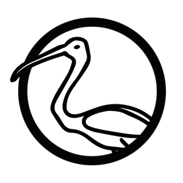

# {#Thoth}, a simple static blog generator.

## Meet Thoth  

{#Thoth} (or more commonly Thoth) is a simple static blog generator written in C++.   
Just write your articles in Markdown, put them in a directory, point Thoth to this directory, add a template, SFTP settings and an output directory, and *voilà* !
Thoth will generate HTML pages for all articles, drafts, and index, and upload the output to your SFTP. 

## Setup
You can ask Thoth to create a folder containing a config file and all the needed directories by running the command `thoth --path /path/to/the/future/blog/directory --setup`. Then, fill the config file with the corresponding information, and register your SFTP password in the OS X keychain using the `thoth --path /path/to/blog/config --set-password "yourPassw0rd"`.

The config file is a plain text file, so you can create it yourself if you prefer (see the **Config file** section). In all cases, you must fill it before running other Thoth commands.

Don't forget to add a template in the corresponding folder. You can use the default template, stored in the [template folder](http://github.com/kosua20/thoth2/tree/master/template/) of this repository.

## Writing
Each article markdown file should be put in the `articles` directory, and follow this header style :
    
    #The title
    32/12/2032
    The author (optional)
    
    The beginning of the article content starts here. Nullam id dolor id nibh ultricies vehica  
    ut id elit. Maecenas sed diam eget risus varius blandit sit amet non magna.
    
For drafts, just replace the date on the second line by the mention `draft`. Those files will be treated separately, and listed in an `index-drafts.html` file in the output.

Once you have finished writing your article, run the `thoth --path /path/to/your/blog/config --scribe` command to automatically update the output and upload it. Do the same if you want to preview a draft online, or just call `thoth --path /path/to/your/blog/config --generate` to generate it in the output folder.

## Commands 

- `--p,--path <path to config>`  
    Path to the blog configuration file, non-relative.

### Setup
- `--setup`  
    Creates the configuration file and folders (articles, template, output, resources) specified by `--path`.
- `--sp,--set-password`  
    Set or udpate the password in the system keychain for the configuration (specified by `--path`).
- `--test`  
    Check the validity of the configuration (specified by `--path`) and attempts to connect to the SFTP server.

### Process
- `--generate`  
    Generates the site (specified by `--path`). All existing files are kept. Drafts are updated. New articles are added. Index is rebuilt.
- `--upload`  
    Upload to the SFTP server the content of the blog (specified by `--path`) that is not already present.
- `--scribe`  
    Combines `generate` and `upload` with the corresponding config and options.

### Modifiers
- `--d,--drafts-only`  
    Process drafts only.
- `--r,--resources-only`  
    Update resources only.
- `--f,--force`  
    Force generation/upload of all blog files

### Infos
- `--v,--version`  
    Displays the current Thoth version.
- `--license`  
    Display the license message.

## Functionalities

### Templates
Create your own HTML templates : Thoth expects at least two files in the template folder: index.html and article.html. All other files and folders will be also copied. Thoth uses a keywords system for inserting your articles content in the template you created or downloaded. Those keywords are simple and easy-to-use. You can use :

- `{#BLOG_TITLE}` to insert the blog title
- `{#TITLE}` to insert an article title
- `{#AUTHOR}` to insert the author name
- `{#DATE}` to insert the date of an article
- `{#LINK}` to insert a link to an article.
- `{#CONTENT}` to insert the content of an article
- `{#SUMMARY}` to insert a shortened version of an article (200-300 characters max.)
- `{#ROOT_LINK}` to insert a link to the root of the blog
- `{#ARTICLE_BEGIN}` and `{#ARTICLE_END}` in the index.html template to delimitate the HTML corresponding to an article item in the list.

You can also provide a `syntax.html` file containing code for syntax highlighting. It will be inserted in the `<head>` section of each article that contains at least a block of code (`<pre><code>...</code></pre>`).

### Config file
A simple, human-readable config file. No XML, JSON or YAML. Just a simple flat text file, nothing more. It should be put at the root of your blog folder, along with `articles`, `template`, `output` folders. The current settings are :

- the path to the template folder (defaults to `rootPath/template`)  
`templatePath:      /custom/path/to/the/template/folder`

- the path to the articles folder containing the .md files (defaults to `rootPath/articles`)  
`articlesPath:      /custom/path/to/the/articles/folder`

- the path where Thoth should output the generated content (defaults to `rootPath/output`)  
`outputPath:        /custom/path/to/the/output/folder`

- the default author name to use on each article page (defaults to the current Mac user)  
`defaultAuthor:     Simon Rodriguez`

- the date style used in each article (in the .md file) (defaults to %m/%d/%Y, see std::get_time specification for available formats)  
`dateStyle:     %d/%m/%Y`

- the title of the blog (defaults to "A new blog")  
`blogTitle:     My blog !`

- the default width for each image in articles html pages (defaults to `640`)  
`imageWidth:        800`

- set to true if you want each image of an article to link directly to the corresponding file (defaults to `false`)  
`imagesLinks:       true`

- the sftp address pointing to the exact folder where the output should be uploaded  
`ftpAdress:     domain-sftp.com:/folder/for/blog`

- the ftp username  
`ftpUsername:   `   

- the ftp port to use (defaults to 22)  
`ftpPort:       22`

- the online URL of the blog, without `http://` (for RSS generation)  
`siteRoot:  blog.mysite.com`

- the number of articles to list in the RSS feed (defaults to 10)  
`rssCount:  10`

- the length of each article summary on the index page (defaults to 400)  
`summaryLength:  400`

The password for the SFTP access is stored in the system user keychain. See the `set-password` command for more details.

### Extended markdown parsing
You can create reference footnotes using the common format :

    This is a sentence[^refnote]
    ...
    [^refnote]: The footnote content

Use the classes `footnote-link` and `footnote` in your template to style the footnotes links and content, respectively.

You can also easily manage your images size in markdown, either by setting a default width, or defining it using the following syntax, replacing the title: 

    

Title and caption will then use the alt text.

Pictures from your articles which are stored on your computer are also retrieved by Thoth and copied in article-specific folders, for an easier management.

You can also integrate HTML5 videos in your articles using the following syntax:

    ?[alt text](path/to/video.mp4 "800")    

### Comments and ignored files
In the config file, lines beginning with a `#` or a `_` will be ignored.  
During articles processing and copy, files beginning with `_` or `#` won't be processed or copied.

## Future improvements

- adding proper generation of `sitemap.xml` file
